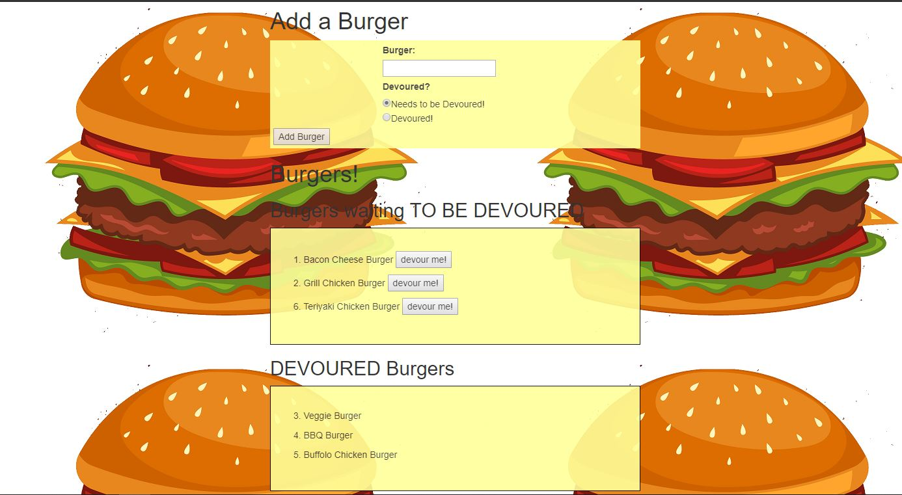

# Eat-Da-Burger
Node Express Handlebars
# Node Express Handlebars

### Overview

In this assignment,I'll create a burger logger with MySQL, Node, Express, Handlebars and a homemade ORM .I will  follow the MVC design pattern; use Node and MySQL to query and route data in your app, and Handlebars to generate your HTML.

### App features

* Eat-Da-Burger! is a restaurant app that lets users input the names of burgers they'd like to eat.

* Whenever a user submits a burger's name, your app will display the burger on the left side of the page -- waiting to be devoured.

* Each burger in the waiting area also has a `Devour it!` button. When the user clicks it, the burger will move to the right side of the page.

* Your app will store every burger in a database, whether devoured or not.

